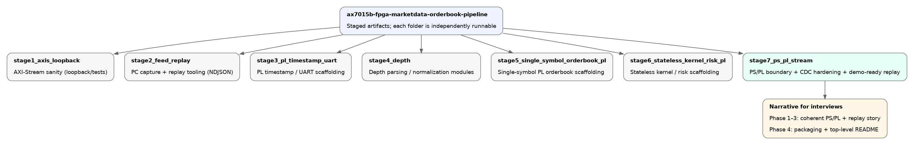
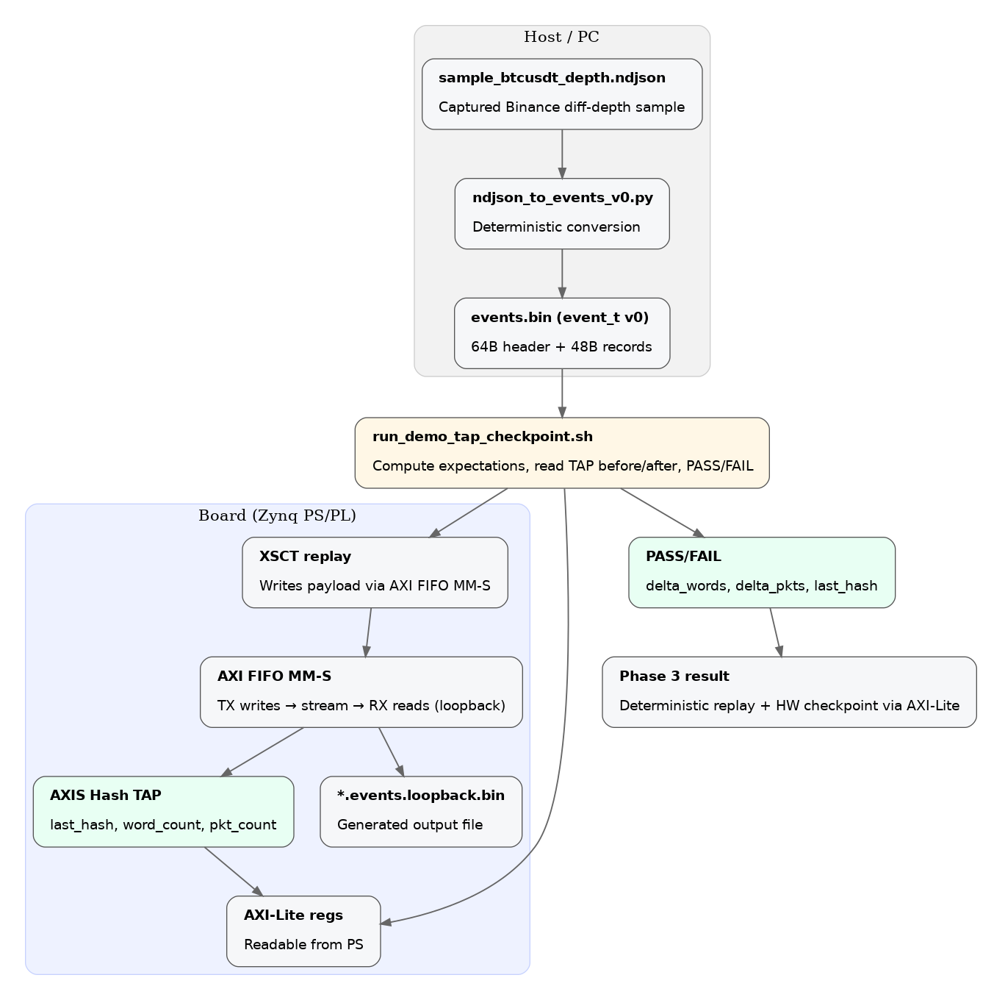
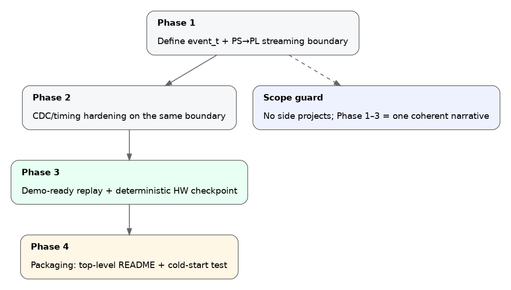

# AX7015B FPGA Market Data Orderbook Pipeline

A staged FPGA/SoC project on ALINX AX7015B (Zynq-7015) focused on a reproducible, deterministic market-data replay path and measurable FPGA-side validation.

This repo is organized as independent stages so each milestone is runnable, testable, and reviewable without needing the whole system integrated at once.

## Quickstart (Phase 3 demo-ready)

If you just want the reproducible demo artifact:

```bash
git checkout phase3-demo-ready
./stage7_ps_pl_stream/phase3_demo_ready/scripts/run_demo_tap_checkpoint.sh
```

Expected (key lines):

* `PASS: TAP delta + last_hash matched.`
* `metric: elapsed_s=... events_per_s=... (events=...)`

What this proves:

* A committed dataset (`events.bin`) is replayed through PS->PL via AXI FIFO.
* A PL-side checkpoint (hash + counters over AXI-Stream) is read back over AXI-Lite.
* The script asserts deterministic deltas and a frozen expected hash (PASS/FAIL), then prints one metric.

## Repo layout (staged)

Top-level stages:

* `stage1_axis_loopback/`
  AXI-Stream sanity: sources/sinks, simple pipeline blocks, simulation scaffolding.
* `stage2_feed_replay/`
  Host capture + replay tooling (Binance depth capture on PC, file normalization utilities).
* `stage3_pl_timestamp_uart/`
  PL timestamping + UART-to-stream bridging (early hardware ingest scaffolding).
* `stage4_depth/`
  Depth event parsing/normalization modules.
* `stage5_single_symbol_orderbook_pl/`
  Single-symbol orderbook in PL (best bid/ask, quantities) scaffolding.
* `stage6_stateless_kernel_risk_pl/`
  Stateless strategy / risk limiter scaffolding consuming book state.
* `stage7_ps_pl_stream/`
  The “interview-grade reproducible boundary”: PS/PL streaming, CDC hardening, and demo-ready replay.

Stage 7 sub-phases:

* `stage7_ps_pl_stream/phase1_ps_pl/`
  PS/PL control + basic stream boundary proofs.
* `stage7_ps_pl_stream/phase2_cdc_timing_demo/`
  CDC/timing hardening demos for the exact PS->PL boundary used later.
* `stage7_ps_pl_stream/phase3_demo_ready/`
  Deterministic replay of `events.bin` + PL checkpoint (hash/counters) + one-shot PASS/FAIL runner.

## Phase 3 demo-ready: what you need

### Prerequisites

* Python 3
* XSCT (from AMD/Xilinx toolchain)
* Board programmed with a bitstream that provides:

  * AXI FIFO MM-S at `0x43C00000` (default)
  * TAP AXI-Lite regs at `0x40000000` (default)
  * A TX->RX loopback path (FIFO replay writes can be read back)

### Run the demo

From repo root:

```bash
./stage7_ps_pl_stream/phase3_demo_ready/scripts/run_demo_tap_checkpoint.sh
```

Optional overrides (only if your address map differs):

```bash
FIFO_BASE=0x43C00000 TAP_BASE=0x40000000 CHUNK_RECORDS=40 EXPECTED_LAST_HASH=0x651E42BC \
  ./stage7_ps_pl_stream/phase3_demo_ready/scripts/run_demo_tap_checkpoint.sh
```

### Output artifacts

* Generated loopback file (ignored by git):

  * `stage7_ps_pl_stream/phase3_demo_ready/data/*.events.loopback.bin`
* Deterministic verification output:

  * PASS/FAIL verdict from TAP counters + hash
  * Optional software checksum checkpoints (SHA-256) printed by the runner

## Data format: `events.bin` (event_t v0)

Phase 3 uses a fixed binary container:

* 64-byte header:

  * magic: `EVT0BIN\0`
  * version: 0
  * record_size: 48 bytes
  * price_scale, qty_scale (u64)
  * symbol (ASCII, fixed field)
* Payload: fixed-size records (`record_size` bytes each)

The Phase 3 runner derives `total_records` from `(file_size - 64) / record_size` and computes expected word/packet deltas from that.

## Optional: regenerate the committed sample

If you want to regenerate `events.bin` from the committed NDJSON sample:

```bash
python3 stage7_ps_pl_stream/phase3_demo_ready/tools/ndjson_to_events_v0.py \
  --in  stage7_ps_pl_stream/phase3_demo_ready/data/sample_btcusdt_depth.ndjson \
  --out stage7_ps_pl_stream/phase3_demo_ready/data/sample_btcusdt_depth.events.bin
```

Then rerun the demo checkpoint.

## Troubleshooting

### AHB AP transaction error during TX writes

Cause: you are writing more words into FIFO TX than vacancy allows before draining/committing.
Fix: reduce chunk size:

```bash
CHUNK_RECORDS=20 ./stage7_ps_pl_stream/phase3_demo_ready/scripts/run_demo_tap_checkpoint.sh
```

### PASS fails (delta or hash mismatch)

* `delta_words` mismatch: drop/corruption or record sizing mismatch.
* `delta_pkts` mismatch: packetization/chunking mismatch (check `CHUNK_RECORDS`).
* `last_hash` mismatch: dataset or hash logic changed; only update `EXPECTED_LAST_HASH` intentionally.

If you suspect loopback corruption, classify mismatches:

```bash
python3 stage7_ps_pl_stream/phase3_demo_ready/tools/compare_events_bins.py \
  --a stage7_ps_pl_stream/phase3_demo_ready/data/sample_btcusdt_depth.events.bin \
  --b stage7_ps_pl_stream/phase3_demo_ready/data/sample_btcusdt_depth.events.loopback.bin
```

## Source-control conventions

This repo tracks only reproducible sources:

* RTL (`.v`, `.sv`), constraints (`.xdc`), IP metadata (`.xci`), scripts (`.tcl`, `.py`), docs
* Generated Vivado artifacts are intentionally not tracked (`.Xil/`, `*.runs/`, generated bit/dcp/log caches)

## Architecture diagrams

### Repo map


### Phase 3 demo datapath


### Phase 1–4 narrative


## Disclaimer

This is an engineering demo and validation harness for FPGA/SoC dataflow correctness and determinism, not a production trading system.